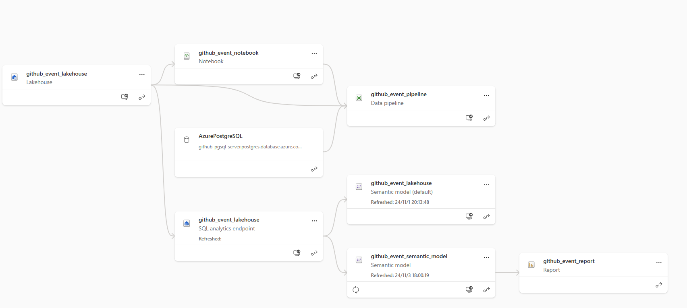
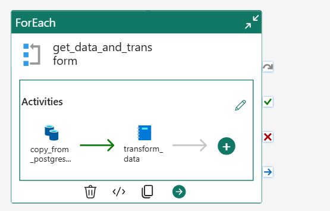
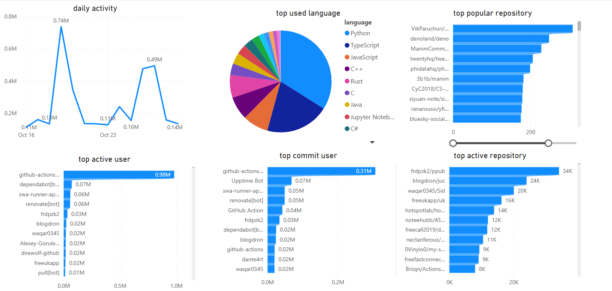

# TrendTrackr - GitHub Data Analysis Empowered by Microsoft Fabric

## Workflow Diagram

## Setup Steps

### 1. Loading GitHub Events Data to PostgreSQL

- **GitHub Actions** collects GitHub events data (e.g., push events, pull requests, trending repositories) every hour.
- The data is then loaded into **Azure PostgreSQL** as an initial storage location, which provides structured storage for the collected data.

### 2. Copy Data to Lakehouse Using Dataflow Gen2

- **Azure Data Factory (ADF)** is used to create a **Dataflow Gen2 copy job** that extracts data from **Azure PostgreSQL** and loads it into **Microsoft Fabric Lakehouse**.
- This step ensures that the Lakehouse is up to date with the latest GitHub events, making it ready for detailed analysis.

### 3. Data Analysis with Microsoft Fabric Notebook

- Once the data is loaded into the **Lakehouse** using **Dataflow Gen2**, the next step is to perform in-depth analysis using a **Microsoft Fabric Notebook**.
- The notebook performs analyses such as identifying GitHub event trends, contributor activity, repository activity, language popularity, and commit statistics.
- All analysis results are stored back in the **Lakehouse**, which serves as the main storage for structured data and insights.

### 4. Generating Reports with Power BI

- A **Power BI (PBI)** report is connected to the **Lakehouse**.
- This report is refreshed each time new data is loaded into the **Lakehouse**, allowing stakeholders to view up-to-date insights on GitHub activity.

## Dataset Description

The dataset used in this project consists of GitHub events data gathered using the GitHub Events API. It includes different types of events such as push events, pull requests, and repository trend data. The data is collected hourly via **GitHub Actions**, ensuring a rich and up-to-date dataset for analysis of community activities, contributions, and programming language trends.

## Pipeline Preview

- The main pipeline involves the following steps:
  - **GitHub Actions** collects data and loads it into **Azure PostgreSQL**.
  - **Dataflow Gen2 copy job** extracts data from **PostgreSQL** and loads it into the **Lakehouse**.
  - **Microsoft Fabric Notebook** performs analysis, and the results are stored in the **Lakehouse**.
  - **Power BI** connects to the **Lakehouse** to visualize analysis results.

## Power BI Report Example

Below is an example of how the results can be presented using **Power BI**.

