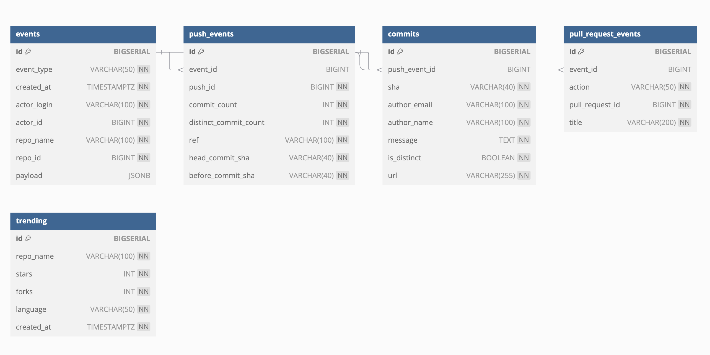

# Database Schema for GitHub Data Analysis Project

## Overview

This database schema is designed to support the GitHub Data Analysis Project, a system aimed at analyzing GitHub activity, such as push events, pull requests, and trending repositories. The database structure allows us to store, organize, and efficiently query GitHub data to generate insights about repository trends, contributor activities, and more.

The database consists of several tables, each designed to store different types of GitHub events. Below is a detailed description of each table, its purpose, and its fields.

## Entity Relationship Diagram (ERD)

The database schema is designed with relationships between different tables, such as the connection between `events` and `push_events`, or `push_events` and `commits`. These relationships help establish connections across different types of GitHub activities.

## Tables and Relationships

### 1. `events`

This table stores general information about GitHub events, such as push events, pull requests, and other activity types.

- **Columns**:
  - `id` (BIGSERIAL, Primary Key): Unique identifier for the event.
  - `event_type` (VARCHAR, NOT NULL): Type of the GitHub event (e.g., PushEvent, PullRequestEvent).
  - `created_at` (TIMESTAMPTZ, NOT NULL): Timestamp when the event occurred.
  - `actor_login` (VARCHAR, NOT NULL): Login of the user who triggered the event.
  - `actor_id` (BIGINT, NOT NULL): Unique identifier of the actor.
  - `repo_name` (VARCHAR, NOT NULL): Name of the repository related to the event.
  - `repo_id` (BIGINT, NOT NULL): Unique identifier of the repository.
  - `payload` (JSONB): Additional data related to the event.

### 2. `push_events`

This table stores information related to GitHub push events, which represent the commits made to a repository.

- **Columns**:
  - `id` (BIGSERIAL, Primary Key): Unique identifier for the push event.
  - `event_id` (BIGINT, Foreign Key): References the `events` table to connect the push event to a specific GitHub event.
  - `push_id` (BIGINT, NOT NULL): Unique identifier for the push event.
  - `commit_count` (INT, NOT NULL): Number of commits associated with the push.
  - `distinct_commit_count` (INT, NOT NULL): Number of distinct commits within the push.
  - `ref` (VARCHAR, NOT NULL): The Git reference (branch name) associated with the push.
  - `head_commit_sha` (VARCHAR, NOT NULL): SHA of the head commit.
  - `before_commit_sha` (VARCHAR, NOT NULL): SHA of the commit before the push.

### 3. `commits`

This table stores details of individual commits made within a push event.

- **Columns**:
  - `id` (BIGSERIAL, Primary Key): Unique identifier for each commit.
  - `push_event_id` (BIGINT, Foreign Key): References the `push_events` table to associate the commit with a specific push.
  - `sha` (VARCHAR, NOT NULL): SHA identifier of the commit.
  - `author_email` (VARCHAR, NOT NULL): Email address of the commit author.
  - `author_name` (VARCHAR, NOT NULL): Name of the commit author.
  - `message` (TEXT, NOT NULL): Commit message detailing the changes made.
  - `is_distinct` (BOOLEAN, NOT NULL): Indicates whether the commit is distinct.
  - `url` (VARCHAR, NOT NULL): URL link to the commit details on GitHub.

### 4. `pull_request_events`

This table stores information about pull request events, such as when a pull request is opened, closed, or merged.

- **Columns**:
  - `id` (BIGSERIAL, Primary Key): Unique identifier for the pull request event.
  - `event_id` (BIGINT, Foreign Key): References the `events` table to connect the pull request event with a GitHub event.
  - `action` (VARCHAR, NOT NULL): The action performed on the pull request (e.g., opened, closed, merged).
  - `pull_request_id` (BIGINT, NOT NULL): Unique identifier for the pull request.
  - `title` (VARCHAR, NOT NULL): Title of the pull request.

### 5. `trending`

This table stores information related to GitHub trending repositories, including metadata such as stars, forks, and language used.

- **Columns**:
  - `id` (BIGSERIAL, Primary Key): Unique identifier for the trending repository record.
  - `repo_name` (VARCHAR, NOT NULL): Name of the repository.
  - `stars` (INT, NOT NULL): Number of stars received by the repository.
  - `forks` (INT, NOT NULL): Number of times the repository has been forked.
  - `language` (VARCHAR, NOT NULL): Programming language used in the repository.
  - `created_at` (TIMESTAMPTZ, NOT NULL): Timestamp of when the trending data was recorded.
